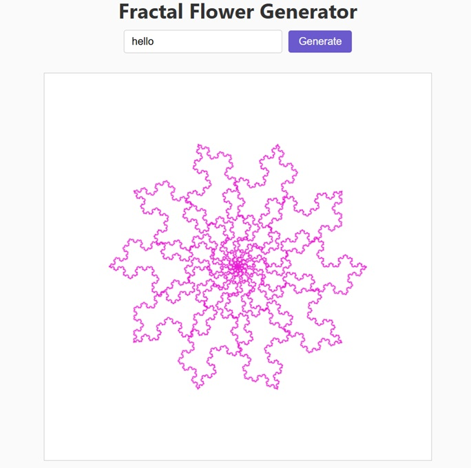

# Fractal Flower Generator 🌸

A simple web app that generates fractal flower patterns based on a user-entered seed (word or number). Each petal edge is drawn using a recursive Koch-curve algorithm, producing self-similar, snowflake-like detail. Built with HTML, CSS, and JavaScript.  

## Features

- User inputs a seed (word or number).
- Generates a unique fractal flower pattern using Koch curves.
- Customizes depth, number of petals, and color based on the seed.
- Responsive and easy-to-use UI.

## Live Demo  
🔗 [Fractal Flower Generator](https://cvcpatton.github.io/fractal-flower-gen/index.html "Fractal Flower Generator")

## Sample Output  
  

## Usage

1. Clone the repository:
```bash
   git clone https://github.com/yourusername/fractal-flower-gen.git
   cd fractal-flower-generator 
```

2. Open `index.html` in your browser.

3. Enter a word or number seed, click Generate, and enjoy the fractal art!

## Potential Upgrades  

- Change colors for each level of depth.
- Increase petal count for more complexity.
- Specific user input for depth level and color choice.
- A button to save the image as a PNG/JPG file.

## File Structure  

* index.html — Main webpage with input, button, and canvas.
* styles.css — Styling for layout and controls.
* script.js — JavaScript code for fractal generation.

## License

MIT License © Cathy Patton
